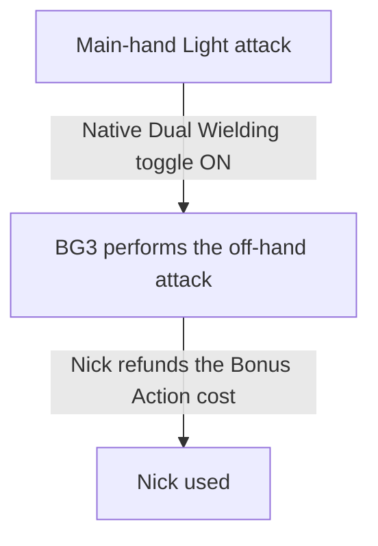
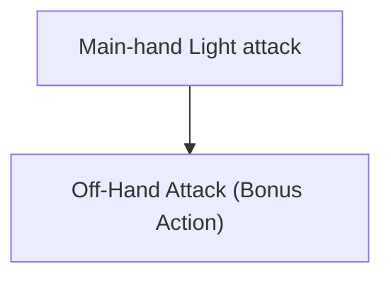
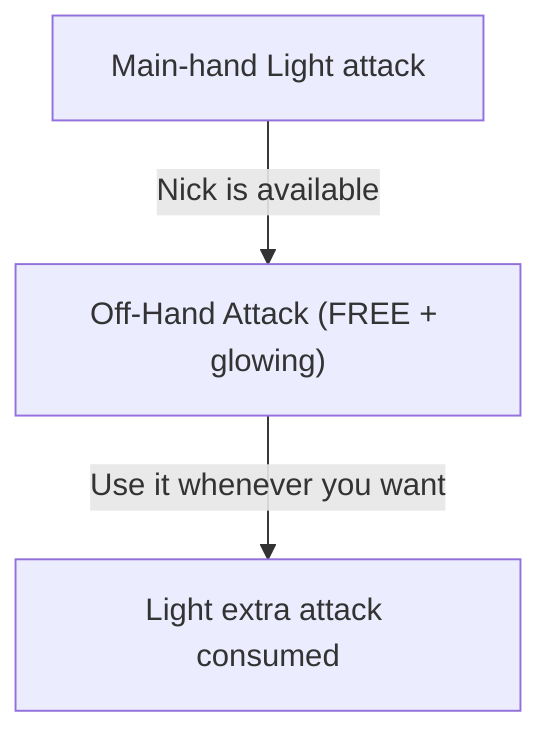
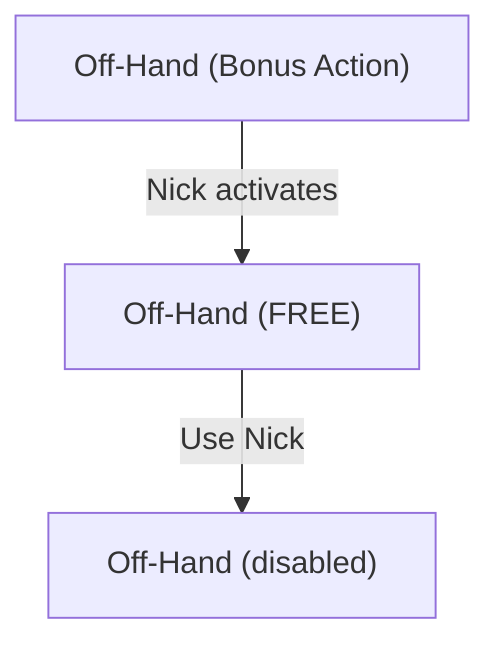
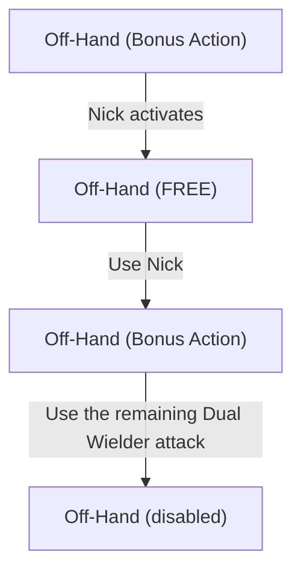
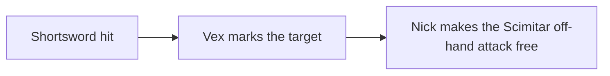

# 5.5e Weapon Mastery

This mod adds the **Weapon Mastery** system from D&D 5.5e to Baldur's Gate 3.

The mod adds the 5.5e Weapon Mastery properties to BG3 weapons (for example, **Vex** on Shortswords, **Nick** on Daggers, and **Graze** on Greatswords). Classes can choose the masteries included in their progression.

The goal is **not** to reproduce every tabletop rule literally. It is to make Weapon Mastery feel like a feature Larian could have added to BG3: familiar level-up choices, minimal combat interruptions, support for BG3's loot-heavy progression, and actions that use the game's existing UI whenever possible. When we must choose, we prioritize the _rule of fun_ over exact tabletop fidelity.

## Usage

- During level-up, choose the mastery properties available to your class.
- Use the table below to equip weapons that have the mastery you chose.
- Check the standard attack action tooltip to see the mastery used by the equipped weapon.
- Most masteries apply automatically. Cleave gives you a follow-up target, Nick follows BG3's native dual-wielding toggle, and Push uses BG3's interrupt system.

## Requirements

This mod has no required dependencies.

We recommend using [Item and Spell Bug Fixes](https://mod.io/g/baldursgate3/m/item-and-spell-bug-fixes) with this mod. It fixes abilities that this mod can then apply masteries to.

## Compatibility

Mods that identify attacks by their properties should remain compatible. The table shows the expected results for common methods.

| How the other mod identifies an attack | Expected result |
| --- | --- |
| It checks attack properties, such as weapon, melee, ranged, main hand, or off hand. | It should work. |
| It checks whether the attack is a child or variant of a standard BG3 attack. | It should work. |
| It checks only the exact ID of a standard BG3 attack. | It might not detect the replacement attack. |
| It also replaces the same standard attack with `AttackSpellOverride`. | The overrides can conflict. |

BG3 gives each attack action a spell ID. This mod uses `AttackSpellOverride` to show the active mastery in the action tooltip. The replacement is a child of the standard BG3 attack, but it has a different ID.

For example, an exact check for `Target_MainHandAttack` or `Target_OffhandAttack` might not detect the replacement. A check for the attack's properties or parent should detect it.

The mod applies an override only when the character knows the mastery and has an eligible weapon in that equipment slot. It does not replace weapon records. The passive system still applies the mastery effect. The replacement spell changes the action description.

## Weapon Masteries

The mod implements all eight 5.5e _Weapon Mastery_ properties:

| Mastery | Description |
| --- | --- |
| **Cleave** | Once per turn, **hitting** with a Greataxe or Halberd lets you make another attack against a nearby target. |
| **Graze** | When you **miss** with a Glaive or Greatsword, deal damage equal to your attack **Ability Modifier**. |
| **Nick** | Once per turn, **attacking** with a **Light** melee weapon while wielding a Dagger, Light Hammer, Sickle, or Scimitar in your off hand lets you make your next off-hand attack without spending a **Bonus Action**. |
| **Push** | When you **hit** with a Greatclub, Pike, Warhammer, or Heavy Crossbow, you can push the target 3 m away. |
| **Sap** | When you **hit** with a Mace, Spear, Flail, Longsword, Morningstar, or War Pick, the target gains **Disadvantage** on its next attack. |
| **Slow** | When you damage a target with a Club, Javelin, Light Crossbow, or Longbow, reduce its **Movement Speed** by 3 m. |
| **Topple** | When you **hit** with a Quarterstaff, Battleaxe, Maul, or Trident, the target must succeed a **Constitution Saving Throw** or fall **Prone**. |
| **Vex** | When you damage a target with a Handaxe, Rapier, Shortsword, Shortbow, or Hand Crossbow, gain **Advantage** on your next attack against it. |

## Attack action tooltips

When a character knows a mastery and equips an eligible weapon, the standard attack action describes that mastery. For example, the action for a Topple weapon says that the target may fall **Prone**. The tooltip also shows the Constitution save.

The tooltip follows the weapon in each equipment slot:

- The main-hand and off-hand actions can show different masteries.
- Melee and ranged actions have separate descriptions where eligible weapons support them.
- Nick changes only the off-hand action.
- A mastery for a two-handed weapon appears only on the main-hand action.

The mod does not change the Throw action tooltip. A thrown attack can still apply a mastery when BG3 identifies it as a supported weapon attack.

## Class progression

The mod adds Weapon Mastery selectors to Barbarian, Fighter, Paladin, Ranger, and Rogue progression. The numbers below show how many mastery properties the class selects at each class level.

| Class | Weapon access | Class level 1 | Class level 4 | Class level 10 | Total |
| --- | --- | ---: | ---: | ---: | ---: |
| Barbarian | Melee weapons | 2 | 1 | 1 | 4 |
| Fighter | Proficient weapons | 3 | 1 | 1 | 5 |
| Paladin | Proficient weapons | 2 | — | — | 2 |
| Ranger | Proficient weapons | 2 | — | — | 2 |
| Rogue | Proficient weapons | 2 | — | — | 2 |

The level 1 selection is available both to single-class characters and when entering the class through multiclassing. The listed levels are class levels, not total character levels.

All selectors use the same list of eight mastery properties. A mastery only applies when the character is proficient with the weapon, and Barbarian access is limited to melee weapons.

Classes not listed here do not receive a Weapon Mastery selector from this mod.

## How this mod differs from the 5.5e rules

This mod makes three intentional changes to the tabletop rules to fit BG3.

### You choose mastery properties, not specific weapon types

In 5.5e, _Weapon Mastery_ normally asks you to master specific weapon types.

For example:

- **Dagger**: _Nick_
- **Rapier**: _Vex_

This mod lets you choose the _mastery_ properties themselves:

- **Nick**
- **Vex**

Weapons keep their normal mastery. Choosing **Vex** does **not** give Vex to a Dagger.

> [!NOTE]
> BG3 revolves heavily around finding and swapping magical weapons. If a class feature stopped working because you found a better Shortsword after choosing Rapier several levels earlier, the tabletop weapon restriction would be more disruptive here than it is at a table.

### Masteries are level-up choices

The 5.5e rules let you change your mastered weapon types after a Long Rest. This mod does not add a new Long Rest retraining system.

Weapon Masteries are selected during level-up. They remain part of your build until you respec through **Withers**, like other BG3 character-building choices.

This keeps the system simple and consistent with the rest of the game.

### Most masteries apply automatically

Several tabletop mastery descriptions use wording such as "you can," so their use is technically optional.

In BG3, asking the player whether to apply Graze, Sap, Slow, or Topple after every attack would turn a multiattack turn into a wall of prompts. Push is the exception: it uses BG3's interrupt system and is enabled with **Ask** by default. You can leave it as a prompt or set it to run automatically.

The intended behavior is therefore:

- **Cleave**: player chooses the follow-up target
- **Graze**: automatic
- **Nick**: follows the native Dual Wielding toggle; linked attacks can run together, or the free off-hand attack can remain separate
- **Push**: enabled with **Ask** by default; can be set to automatic
- **Sap**: automatic
- **Slow**: automatic
- **Topple**: automatic
- **Vex**: automatic

The rule is simple: effects that are almost always beneficial should work automatically.

## How Nick works

Nick uses BG3's native Dual Wielding toggle and existing action UI. BG3 provides an off-hand attack after a main-hand attack, and the [Dual Wielding toggle](https://bg3.wiki/wiki/Light_%28weapon_property%29) controls whether the two attacks are linked or made separately.

When the native toggle is on, BG3 can link the main-hand and off-hand attacks into one action:

Nick detects the Bonus Action spent by this native linked-attack path, refunds it, and records Nick as used for the turn.

When the native toggle is off, the off-hand attack remains a separate Bonus Action attack:

With Nick, the separate off-hand attack becomes free:

The free off-hand attack remains available as a glowing action. The mod supports both native toggle modes; it does not replace BG3's dual-wielding behavior.

With the native toggle off, you can:

The free attack can target a different enemy and does not have to be used immediately. With the native toggle on, BG3 performs the linked off-hand attack as part of the main-hand action instead.

With the native toggle off, this mirrors the way BG3 presents **Extra Attack**: another attack becomes available, but the player still controls when and where to use it. With the toggle on, BG3's linked-action path controls when the off-hand attack occurs.

### Nick and Dual Wielder

Nick does not normally add an attack. It lets you use the extra off-hand attack granted by the **Light** property without spending a Bonus Action.

The diagrams in this section describe the separate-action path with the native Dual Wielding toggle off. The linked path still uses the same Nick and Dual Wielder accounting.

Therefore, after using Nick:

**Without Dual Wielder:**

Without Dual Wielder, using the free Nick attack consumes the Light-property extra attack.

However, this mod gives BG3's existing **Dual Wielder** feat the interaction it has with Nick in the 5.5e rules:

**With Dual Wielder:**

With Dual Wielder, one additional Bonus Action attack remains available after Nick.

This is a deliberate hybrid.

The mod does **not** otherwise convert BG3's Dual Wielder feat into its 5.5e tabletop version. Its normal BG3 behavior, AC bonus, and weapon rules are left unchanged.

Only its interaction with Nick is adapted so that Nick + Dual Wielder behaves in the fun and recognizable 5.5e way.

## Examples

### Rogue with Vex and Nick

A Rogue chooses:

- **Vex**
- **Nick**

and equips:

- **Main hand:** Shortsword (_Vex_)
- **Off hand:** Scimitar (_Nick_)

Attack with the Shortsword:

With the native Dual Wielding toggle off, the Scimitar attack becomes a separate glowing action. It can target a different enemy and remains a normal, independently targeted weapon attack. You can use it immediately, after moving, after attacking another creature, or after using Cunning Action. With the toggle on, BG3 can perform the Scimitar attack as part of the linked action and Nick refunds its Bonus Action cost.

### Greatsword with Graze

A character who knows **Graze** attacks with a Greatsword and misses.

Instead of turning the miss into a hit, the target automatically takes damage equal to the ability modifier used for the attack, with a minimum of 0.

A Strength-based attack uses Strength. If another feature makes the weapon attack use a different ability, Graze uses that ability modifier instead.

### Warhammer with Push

A character who knows **Push** hits a Large or smaller enemy with a Warhammer.

The enemy is pushed up to 3 m directly away from the attacker.

The effect uses BG3's interrupt system. With the default **Ask** setting, you can accept or decline the push; setting Push to automatic applies it without a prompt.

## Known limitations

### Item tooltips do not show masteries

The mod adds mastery information to attack action tooltips. It does not add **Vex**, **Nick**, or other mastery labels to weapons in the inventory or equipment panels.

The mod identifies a mastery during combat from the attack weapon's proficiency group. Adding the same information to item tooltips would require many weapon-record overrides or a separate UI integration. Weapon-record overrides can remove existing `PassivesOnEquip` data. They can also miss child or modded weapons. UI overrides can conflict with tooltip overhaul mods. See [issue #2](https://github.com/datwaft/5.5e_Weapon_Mastery.bg3/issues/2).

### Topple's combat-log DC is shown as a resolved value

Topple can appear in the combat log as `DC: 9` instead of a formula such as `Topple's DC: 8 + Proficiency Modifier + Strength Modifier`. The passive-triggered saving throw calculates the correct DC from the attack ability and proficiency, but BG3's combat log displays the resolved value for this roll rather than the formula and mastery name.

The mod keeps this implementation because it produces one saving throw with the correct DC. Attempts to attach a custom name to the roll changed the roll structure or ability metadata instead of changing only the log label.

### Unusual weapon-attack contexts are engine-dependent

The mod applies a mastery when BG3 exposes an eligible weapon attack with a supported proficiency group. Weapon-like spells and attacks with secondary effects can use different engine contexts.

The intended boundary is:

- Apply the mastery to the primary weapon attack.
- Do not apply it to a secondary area effect or saving throw only because the action uses a weapon.
- Treat unusual actions as engine-dependent when BG3 does not expose a clear primary weapon attack.

The optional [Item and Spell Bug Fixes](https://mod.io/g/baldursgate3/m/item-and-spell-bug-fixes) mod can broaden which actions BG3 exposes as weapon attacks. It does not change the primary-versus-secondary boundary.

Weapons that use custom or unsupported proficiency groups are not automatically mapped to a mastery. They must use a supported BG3 weapon group or be added explicitly.

## Design references (supplementary)

These links are supplementary design references, not required dependencies. They are included for contributors and readers interested in the implementation details.

In particular:

- [Weapon Mastery Expanded](https://www.nexusmods.com/baldursgate3/mods/24078): generic mastery logic, attack-ability handling, thrown weapons, Vex/Cleave state, and the strongest existing Nick state-machine reference.
- [DnD 5.5e All-in-One / `bg3dnd`](https://github.com/Yoonmoonsik/bg3dnd): mastery-property level-up selection, alternative Nick behavior, Push toggles, and general 5.5e integration.
- [Item and Spell Bug Fixes](https://mod.io/g/baldursgate3/m/item-and-spell-bug-fixes): production examples of modifying existing BG3 actions with `UnlockSpellVariant`, changing action costs, adding icon glow, detecting main-hand/off-hand/thrown attacks, and precisely cleaning up temporary combat states.
- [Weapon Masteries - 2024](https://www.nexusmods.com/baldursgate3/mods/18522): compact native mastery implementation, `SelectPassives` and interrupt experiments.
- [2024 Weapon Mastery](https://mod.io/g/baldursgate3/m/2024-weapon-mastery): additive progression and weapon-kind selection architecture.
- [OneDnD WeaponMastery](https://www.nexusmods.com/baldursgate3/mods/13055): earlier native mastery implementation and useful historical comparison.
- [Weapon Mastery](https://www.nexusmods.com/baldursgate3/mods/12900): alternate Cleave/Nick approaches and examples of BG3's hand-specific limitations.
- [Weapon Mastery](https://mod.io/g/baldursgate3/m/weaponmastery2): compact mastery-property implementation and useful comparison cases.
- [Weapon Mastery](https://mod.io/g/baldursgate3/m/weapon-mastery): weapon-record-based mastery metadata and a useful contrast to runtime weapon detection.
- [5R Conversion](https://mod.io/g/baldursgate3/m/5r-conversion): persistent mastery-selection and Long Rest resource-management techniques.

The goal is not to fork any single implementation wholesale. The mod combines ideas learned from several approaches into a smaller, compatibility-focused system.
