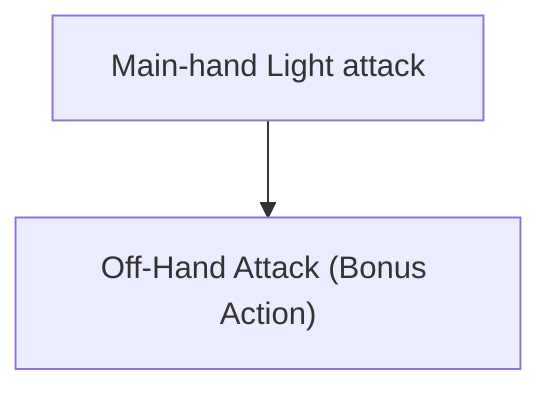
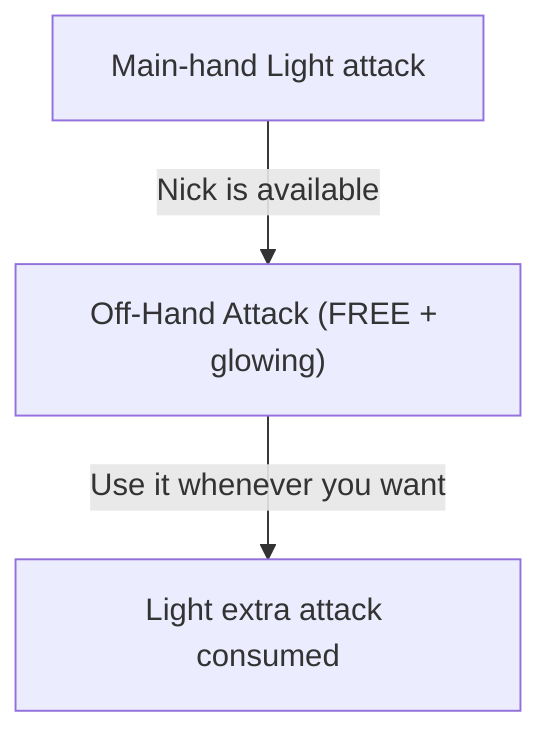
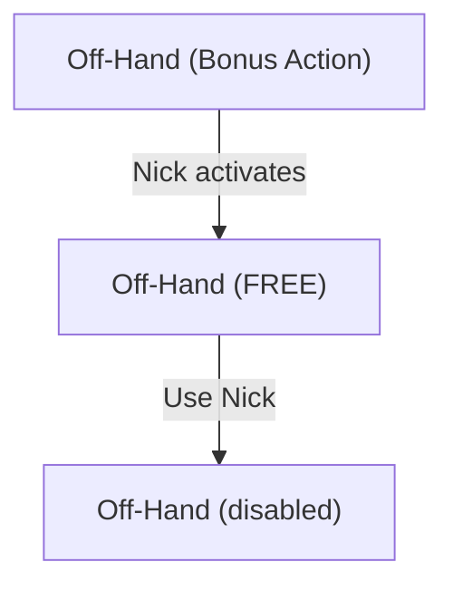
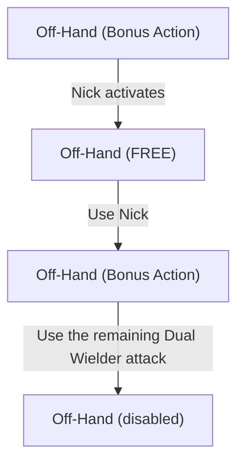
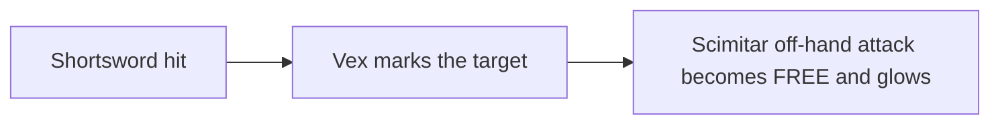

# 5.5e Weapon Mastery

This mod adds the ***Weapon Mastery*** system from D&D 5.5e (2024) to Baldur's Gate 3.

We are adding the 5.5e tabletop _masteries_ to each weapon (e.g. **Vex** on Shortswords, **Nick** on Daggers or **Graze** on Greatswords). The _Weapon Masteries_ can be chosen by classes that have include them in their progression.

The goal is **not** to reproduce every tabletop rule literally. The goal is to make Weapon Mastery feel like a feature Larian could have added to BG3: familiar level-up choices, minimal combat interruptions, support for BG3's loot-heavy progression, and actions that use the game's existing UI whenever possible. When having to choose we prefer the _rule of fun_ over fidelity to the tabletop.

## Requirements

This mod doesn't have any required mods to work with, but it is recommended to use the [Item and Spell Bug Fixes] mod together with this one, as it fixes a lot of abilities to work properly, which helps this mod apply _Masteries_ to those abilities.

I took particular care to make this mod compatible with any other mod, but incompatibilities may appear.

## Weapon Masteries

The mod implements all eight 5.5e _Weapon Masteries_:

| Mastery | Description |
| --- | --- |
| **Cleave** | Once per turn, **hitting** with a Greataxe or Halberd lets you make another attack against a nearby target. |
| **Graze** | When you **miss** with a Glaive or Greatsword, deal damage equal to your attack **Ability Modifier**. |
| **Nick** | Once per turn, **attacking** with a **Light** melee weapon while wielding a Dagger, Light Hammer, Sickle, or Scimitar in your off hand lets you make your next off-hand attack without spending a **Bonus Action**. |
| **Push** | When you **hit** with a Greatclub, Pike, Warhammer, or Heavy Crossbow, you can push the target 3 m away. |
| **Sap** | When you **hit** with a Mace, Spear, Flail, Longsword, Morningstar, or War Pick, the target gains **Disadvantage** on its next attack. |
| **Slow** | When you damage a target with a Club, Javelin, Light Crossbow, or Longbow, reduce its **Movement Speed** by 3 m. |
| **Topple** | When you **hit** with a Quarterstaff, Battleaxe, Maul, or Trident, the target must succeed a **Constitution Saving Throw** or fall **Prone**. |
| **Vex** | When you damage a target with a Handaxe, Rapier, Shortsword, Shortbow, or Hand Crossbow, gain **Advantage** on your next attack against it. |

## BG3 adaptations

There are a few intentional differences from tabletop.

### You choose mastery properties, not individual weapon kinds

In tabletop 5.5e, _Weapon Mastery_ normally asks you to master specific weapon kinds.

For example:

- **Dagger**: _Nick_
- **Rapier**: _Vex_

This mod instead lets you choose the _mastery_ properties themselves:

- **Nick**
- **Vex**

Weapons still keep their canonical _mastery`. Choosing **Vex** does **not** let you put Vex on a Dagger.

> [!NOTE]
> BG3 revolves heavily around finding and swapping magical weapons. Having a class feature stop working because you found a great Shortsword after choosing Rapier several levels ago would make the tabletop weapon-kind restriction much more annoying here than it is at a table.

### Masteries are level-up choices

Tabletop lets you replace mastered weapon kinds after a Long Rest. This mod does not add a new Long Rest retraining system.

Weapon Masteries are selected during level-up and remain part of your build until you respec through **Withers**, like other BG3 character-building choices.

This is both simpler and more consistent with the rest of the game.

### Masteries do not constantly ask for permission

Several tabletop mastery descriptions use wording such as "you can," making their use technically optional.

In BG3, asking the player whether they want free Graze damage, Sap, Slow, or Topple after every attack would turn a multiattack turn into a wall of reaction prompts. The only exception for this is _Push_, which has an interrupt that can be made automatic or manual.

The intended behavior is therefore:

- **Cleave**: player chooses the follow-up target
- **Graze**: automatic
- **Nick**: player chooses when and where to use the free attack
- **Push**: automatic by default, with optional control if useful
- **Sap**: automatic
- **Slow**: automatic
- **Topple**: automatic
- **Vex**: automatic

The rule is simple: if the mastery is almost always beneficial, it should simply work.

## Nick

Nick gets special treatment because BG3 already has an excellent UI for this kind of mechanic.

Normally, dual wielding Light weapons gives you an off-hand attack that costs a Bonus Action:

With Nick:

The mod does **not** automatically bundle the main-hand and off-hand attacks into one click.

You can:

This mirrors the way BG3 presents **Extra Attack**: another attack becomes available, but the player still controls when and where to use it.

### Nick and Dual Wielder

Nick does not normally create an additional attack. It moves the extra attack granted by the **Light** property out of the Bonus Action economy.

Therefore, after using Nick:

**Without Dual Wielder:**

However, this mod gives BG3's existing **Dual Wielder** feat the important interaction it has with Nick in the 2024 rules:

**With Dual Wielder:**

This is a deliberate hybrid.

The mod does **not** otherwise convert BG3's Dual Wielder feat into its 5.5e tabletop version. Its normal BG3 behavior, AC bonus, and weapon rules are left unchanged.

Only its interaction with Nick is adapted so that Nick + Dual Wielder behaves in the fun and recognizable 5.5e way.

## Examples

### Rogue with Vex + Nick

A Rogue chooses:

- **Vex**
- **Nick**

and equips:

- **Main hand:** Shortsword (_Vex_)
- **Off hand:** Scimitar (_Nick_)

Attack with the Shortsword:

You can then move, attack another creature, use Cunning Action, or use the Nick attack immediately.

The Nick attack is still a normal independently targeted weapon attack.

### Greatsword with Graze

A character who knows **Graze** attacks with a Greatsword and misses.

Instead of turning the miss into a hit, the target automatically takes damage equal to the modifier that powered that attack.

A Strength attack uses Strength. If another feature causes the weapon attack to use a different ability, Graze should use that ability instead.

### Warhammer with Push

A character who knows **Push** hits a Large-or-smaller enemy with a Warhammer.

The enemy is pushed up to 3 m directly away from the attacker.

The effect is intended to happen automatically in ordinary combat, because Weapon Mastery should add tactical options without adding reaction-dialog tax to every swing.

## Research and inspiration

Several existing mods were studied while designing this implementation.

In particular:

- [Weapon Mastery Expanded](https://www.nexusmods.com/baldursgate3/mods/24078): generic mastery logic, attack-ability handling, thrown weapons, Vex/Cleave state, and the strongest existing Nick state-machine reference.
- [DnD 5.5e All-in-One / `bg3dnd`](https://github.com/Yoonmoonsik/bg3dnd): mastery-property level-up selection, alternative Nick behavior, Push toggles, and general 5.5e integration.
- [Item and Spell Bug Fixes](https://mod.io/g/baldursgate3/m/item-and-spell-bug-fixes): production examples of modifying existing BG3 actions with `UnlockSpellVariant`, changing action costs, adding icon glow, detecting main-hand/off-hand/thrown attacks, and precisely cleaning up temporary combat states.
- [Weapon Masteries - 2024](https://www.nexusmods.com/baldursgate3/mods/18522): compact native mastery implementation, `SelectPassives` and interrupt experiments.
- [2024 Weapon Mastery](https://mod.io/g/baldursgate3/m/2024-weapon-mastery): additive progression and weapon-kind selection architecture.
- [OneDnD WeaponMastery](https://www.nexusmods.com/baldursgate3/mods/13055): earlier native mastery implementation and useful historical comparison.
- [Weapon Mastery](https://www.nexusmods.com/baldursgate3/mods/12900): alternate Cleave/Nick approaches and examples of BG3's hand-specific limitations.
- [Weapon Mastery](https://mod.io/g/baldursgate3/m/weaponmastery2): compact mastery-property implementation and useful comparison cases.
- [Weapon Mastery](https://mod.io/g/baldursgate3/m/weapon-mastery): weapon-record-based mastery metadata and a useful contrast to runtime weapon detection.
- [5R Conversion](https://mod.io/g/baldursgate3/m/5r-conversion): persistent mastery-selection and Long Rest resource-management techniques.

The goal is not to fork any single implementation wholesale. The mod combines ideas learned from several approaches into a smaller, compatibility-focused system.
