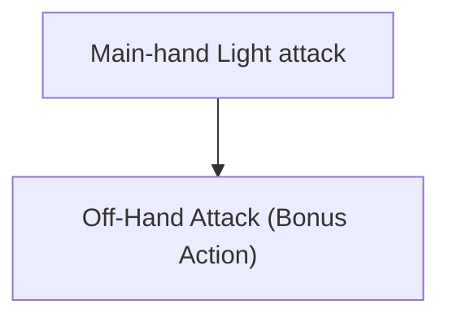
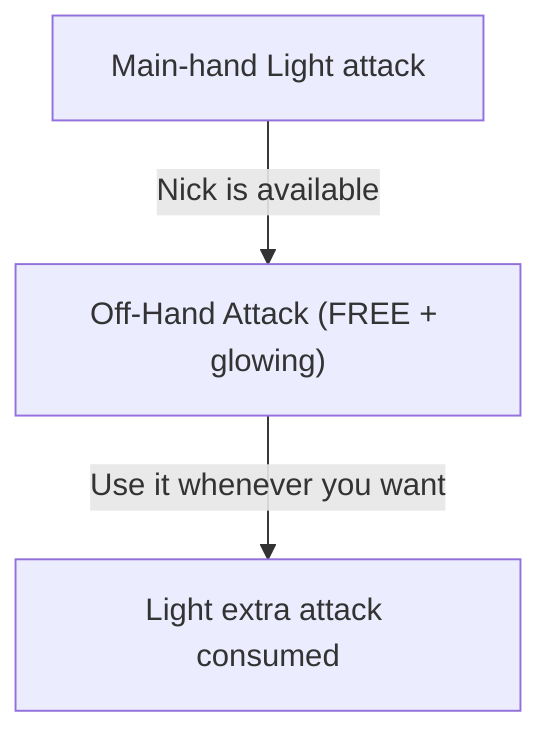
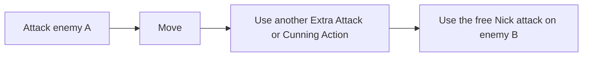
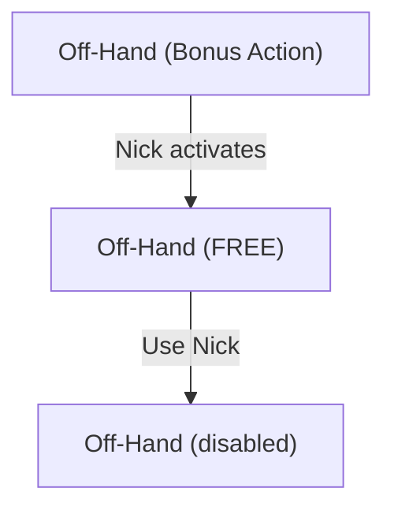
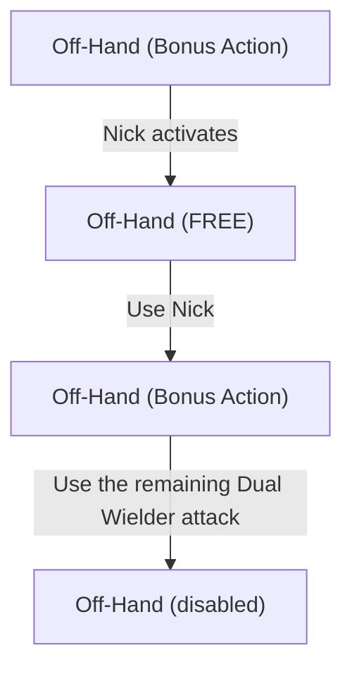
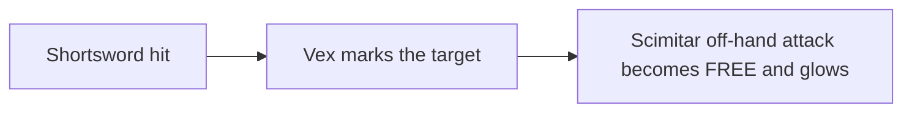

# 5.5e Weapon Mastery

This mod adds the **Weapon Mastery** system from the 2024 D&D rules (often called 5.5e) to Baldur's Gate 3.

The mod adds the 2024 Weapon Mastery properties to BG3 weapons (for example, **Vex** on Shortswords, **Nick** on Daggers, and **Graze** on Greatswords). Classes can choose the masteries included in their progression.

The goal is **not** to reproduce every tabletop rule literally. It is to make Weapon Mastery feel like a feature Larian could have added to BG3: familiar level-up choices, minimal combat interruptions, support for BG3's loot-heavy progression, and actions that use the game's existing UI whenever possible. When we must choose, we prioritize the _rule of fun_ over exact tabletop fidelity.

## Quick start

- Install the mod with your preferred Baldur's Gate 3 mod manager.
- During level-up, choose the mastery properties available to your class.
- Use the table below to equip weapons that have the mastery you chose.
- Most masteries apply automatically. Cleave and Nick let you choose how to use their extra attack, while Push can be configured to run automatically or manually.

## Requirements

This mod has no required dependencies.

We recommend using [Item and Spell Bug Fixes](https://mod.io/g/baldursgate3/m/item-and-spell-bug-fixes) with this mod. It fixes abilities that this mod can then apply masteries to.

The mod is designed to be compatible with other mods, but conflicts are still possible.

## Weapon Masteries

The mod implements all eight 2024 _Weapon Mastery_ properties:

| Mastery | Description |
| --- | --- |
| **Cleave** | Once per turn, **hitting** with a Greataxe or Halberd lets you make another attack against a nearby target. |
| **Graze** | When you **miss** with a Glaive or Greatsword, deal damage equal to your attack **Ability Modifier**. |
| **Nick** | Once per turn, **attacking** with a **Light** melee weapon while wielding a Dagger, Light Hammer, Sickle, or Scimitar in your off hand lets you make your next off-hand attack without spending a **Bonus Action**. |
| **Push** | When you **hit** with a Greatclub, Pike, Warhammer, or Heavy Crossbow, you can push the target 3 m away. |
| **Sap** | When you **hit** with a Mace, Spear, Flail, Longsword, Morningstar, or War Pick, the target gains **Disadvantage** on its next attack. |
| **Slow** | When you damage a target with a Club, Javelin, Light Crossbow, or Longbow, reduce its **Movement Speed** by 3 m. |
| **Topple** | When you **hit** with a Quarterstaff, Battleaxe, Maul, or Trident, the target must succeed a **Constitution Saving Throw** or fall **Prone**. |
| **Vex** | When you damage a target with a Handaxe, Rapier, Shortsword, Shortbow, or Hand Crossbow, gain **Advantage** on your next attack against it. |

## How this mod differs from the 2024 rules

This mod makes three intentional changes to the tabletop rules to fit BG3.

### You choose mastery properties, not specific weapon types

In the 2024 rules, _Weapon Mastery_ normally asks you to master specific weapon types.

For example:

- **Dagger**: _Nick_
- **Rapier**: _Vex_

This mod lets you choose the _mastery_ properties themselves:

- **Nick**
- **Vex**

Weapons keep their normal mastery. Choosing **Vex** does **not** give Vex to a Dagger.

> [!NOTE]
> BG3 revolves heavily around finding and swapping magical weapons. If a class feature stopped working because you found a better Shortsword after choosing Rapier several levels earlier, the tabletop weapon restriction would be more disruptive here than it is at a table.

### Masteries are level-up choices

The 2024 rules let you change your mastered weapon types after a Long Rest. This mod does not add a new Long Rest retraining system.

Weapon Masteries are selected during level-up. They remain part of your build until you respec through **Withers**, like other BG3 character-building choices.

This keeps the system simple and consistent with the rest of the game.

### Most masteries apply automatically

Several tabletop mastery descriptions use wording such as "you can," so their use is technically optional.

In BG3, asking the player whether to apply Graze, Sap, Slow, or Topple after every attack would turn a multiattack turn into a wall of prompts. Push is the only exception: its interrupt can run automatically or manually.

The intended behavior is therefore:

- **Cleave**: player chooses the follow-up target
- **Graze**: automatic
- **Nick**: player chooses when and where to use the free attack
- **Push**: automatic by default, with an optional manual interrupt
- **Sap**: automatic
- **Slow**: automatic
- **Topple**: automatic
- **Vex**: automatic

The rule is simple: effects that are almost always beneficial should work automatically.

## How Nick works

Nick uses BG3's existing action UI for this mechanic.

Normally, dual-wielding Light weapons gives you an off-hand attack that costs a Bonus Action:

The off-hand attack uses your Bonus Action.

With Nick:

With Nick, the off-hand attack becomes free and remains available as a glowing action.

The mod does **not** automatically combine the main-hand and off-hand attacks into one click.

You can:

The free attack can target a different enemy and does not have to be used immediately.

This mirrors the way BG3 presents **Extra Attack**: another attack becomes available, but the player still controls when and where to use it.

### Nick and Dual Wielder

Nick does not normally add an attack. It lets you use the extra off-hand attack granted by the **Light** property without spending a Bonus Action.

Therefore, after using Nick:

**Without Dual Wielder:**

Without Dual Wielder, using the free Nick attack consumes the Light-property extra attack.

However, this mod gives BG3's existing **Dual Wielder** feat the interaction it has with Nick in the 2024 rules:

**With Dual Wielder:**

With Dual Wielder, one additional Bonus Action attack remains available after Nick.

This is a deliberate hybrid.

The mod does **not** otherwise convert BG3's Dual Wielder feat into its 2024 tabletop version. Its normal BG3 behavior, AC bonus, and weapon rules are left unchanged.

Only its interaction with Nick is adapted so that Nick + Dual Wielder behaves in the fun and recognizable 2024-rules way.

## Examples

### Rogue with Vex and Nick

A Rogue chooses:

- **Vex**
- **Nick**

and equips:

- **Main hand:** Shortsword (_Vex_)
- **Off hand:** Scimitar (_Nick_)

Attack with the Shortsword:

The free Nick attack can target a different enemy and remains a normal, independently targeted weapon attack. You can use it immediately, after moving, after attacking another creature, or after using Cunning Action.

### Greatsword with Graze

A character who knows **Graze** attacks with a Greatsword and misses.

Instead of turning the miss into a hit, the target automatically takes damage equal to the ability modifier used for the attack.

A Strength-based attack uses Strength. If another feature makes the weapon attack use a different ability, Graze uses that ability modifier instead.

### Warhammer with Push

A character who knows **Push** hits a Large or smaller enemy with a Warhammer.

The enemy is pushed up to 3 m directly away from the attacker.

The effect applies automatically in ordinary combat. This adds a tactical option without adding an extra prompt after every attack.

## Design references (supplementary)

These links are supplementary design references, not required dependencies. They are included for contributors and readers interested in the implementation details.

In particular:

- [Weapon Mastery Expanded](https://www.nexusmods.com/baldursgate3/mods/24078): generic mastery logic, attack-ability handling, thrown weapons, Vex/Cleave state, and the strongest existing Nick state-machine reference.
- [DnD 5.5e All-in-One / `bg3dnd`](https://github.com/Yoonmoonsik/bg3dnd): mastery-property level-up selection, alternative Nick behavior, Push toggles, and general 5.5e integration.
- [Item and Spell Bug Fixes](https://mod.io/g/baldursgate3/m/item-and-spell-bug-fixes): production examples of modifying existing BG3 actions with `UnlockSpellVariant`, changing action costs, adding icon glow, detecting main-hand/off-hand/thrown attacks, and precisely cleaning up temporary combat states.
- [Weapon Masteries - 2024](https://www.nexusmods.com/baldursgate3/mods/18522): compact native mastery implementation, `SelectPassives` and interrupt experiments.
- [2024 Weapon Mastery](https://mod.io/g/baldursgate3/m/2024-weapon-mastery): additive progression and weapon-kind selection architecture.
- [OneDnD WeaponMastery](https://www.nexusmods.com/baldursgate3/mods/13055): earlier native mastery implementation and useful historical comparison.
- [Weapon Mastery](https://www.nexusmods.com/baldursgate3/mods/12900): alternate Cleave/Nick approaches and examples of BG3's hand-specific limitations.
- [Weapon Mastery](https://mod.io/g/baldursgate3/m/weaponmastery2): compact mastery-property implementation and useful comparison cases.
- [Weapon Mastery](https://mod.io/g/baldursgate3/m/weapon-mastery): weapon-record-based mastery metadata and a useful contrast to runtime weapon detection.
- [5R Conversion](https://mod.io/g/baldursgate3/m/5r-conversion): persistent mastery-selection and Long Rest resource-management techniques.

The goal is not to fork any single implementation wholesale. The mod combines ideas learned from several approaches into a smaller, compatibility-focused system.
